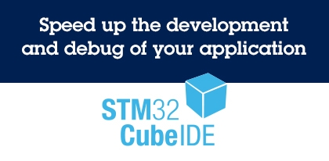

# STM32CubeIDE

### 描述

[STM32CubeIDE](https://www.st.com/zh/development-tools/stm32cubeide.html)是一体式多操作系统开发工具，是STM32Cube软件生态系统的一部分。 

STM32CubeIDE是一种高级C/C++开发平台，具有STM32微控制器和微处理器的外设配置、代码生成、代码编译和调试功能。它基于Eclipse®/CDT™框架和用于开发的GCC工具链，以及用于调试的GDB。它支持集成数以百计的现有插件，正是这些插件使Eclipse® IDE的功能趋于完整。
STM32CubeIDE集成了STM32CubeMX的STM32配置与项目创建功能，以便提供一体化工具体验，并节省安装与开发时间。在通过所选板卡或示例选择一个空的STM32 MCU或MPU，或者预配置微控制器或微处理器之后，将创建项目并生成初始化代码。在开发过程的任何时间，用户均可返回外设或中间件的初始化和配置阶段，并重新生成初始化代码，期间不会影响用户代码。
STM32CubeIDE包含相关构建和堆栈分析仪，能够为用户提供有关项目状态和内存要求的有用信息。
STM32CubeIDE还具有标准和高级调试功能，其中包括CPU内核寄存器、存储器和外设寄存器以及实时变量查看、串行线传输监测器接口或故障分析器的视图。

- ### 所有功能

  - 通过STM32CubeMX来集成服务：STM32微控制器、微处理器、开发平台和示例项目选择引脚排列、时钟、外设和中间件配置项目创建和初始化代码生成具有增强型STM32Cube扩展包的软件和中间件
  - 基于Eclipse®/CDT™，支持Eclipse®插件、GNU C/C++ for Arm®工具链和GDB调试器
  - STM32MP1 系列：支持OpenSTLinux项目：Linux支持Linux
  - 其他高级调试功能包括：CPU内核、外设寄存器和内存视图实时变量查看视图系统分析与实时跟踪(SWV)CPU故障分析工具支持RTOS感知调试，包括Azure
  - 支持ST-LINK（意法半导体）和J-Link (SEGGER)调试探头
  - 从Atollic® TrueSTUDIO®和AC6 System Workbench for STM32 (SW4STM32)导入项目
  - 支持多种操作系统：Windows®、Linux®和macOS®，仅限64位版本
