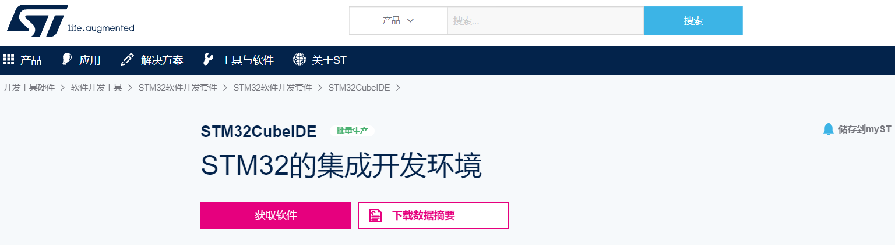
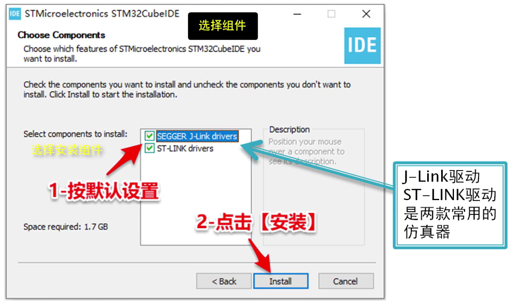
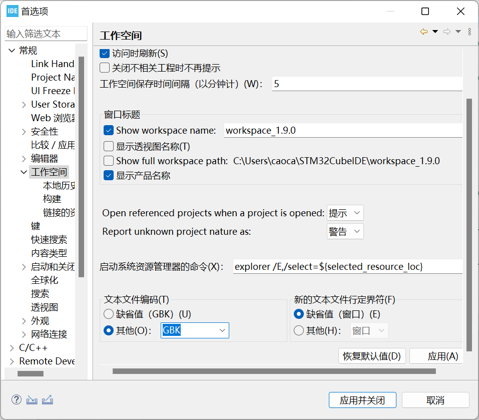
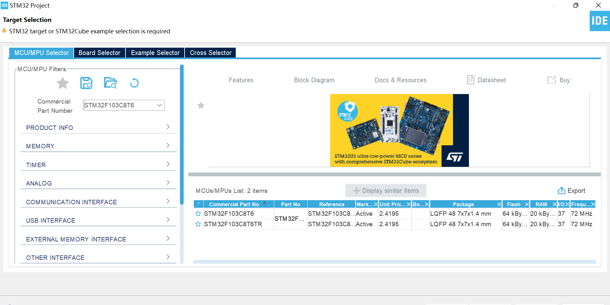

# STM32CubeIDE的安装

目前有许多工具用以对STM32 MCU编程，比如说：STM32CubeIDE、Keil、Clion、VS Code；其中STM32CubeIDE作为ST官方的工具，界面简洁，使用简单，无需过多的配置，安装后即可使用；相对其他工具而言，体验友好。本章将介绍STM32CudeIDE的安装及基本配置，并在文末演示如何快速使用CubeIDE新建工程。

 

## 1 STM32CubeIDE的下载

CubeIDE的官方下载地址：[https://www.st.com/zh/development-tools/stm32cubeide.html]()

在官网可以下载最新版本和更多版本。

 

点击“获取软件”。

 

然后根据自己的电脑系统进行选择并开始下载。

 

## 2 STM32CubeIDE的安装

在下载完成后，会在下载文件夹得到一个zip压缩包，解压后安装（注意，必须解压后安装，不能在压缩包中安装软件。）安装过程与普通软件安装过程相同。安装过程里，在选择组件窗口中，按照默认的勾选设置安装两个组件。

 

## 3 STM32CubeIDE的运行

安装完成后，运行STM32CubeIDE。**设置汉字编码流程**。

1. 点击【窗口】，选择【首选项】

- 

- 

2. 展开【常规】选项，选择【工作空间】，选中【文本文件编码-其他】，点击输入“GBK”，点击【应用并关闭】。

- 

 

## 备注：CubeIDE创建项目

1. 选择菜单栏中【文件】选项，选择【新建】，选择【STM32 Project】。

- 

2. 在【Commercial Part Number】中输入芯片型号，并在右栏中进行选择，然后点击【下一步】。

- 

3. 输入项目名，并点击【完成】，即完成项目创建。

- 
