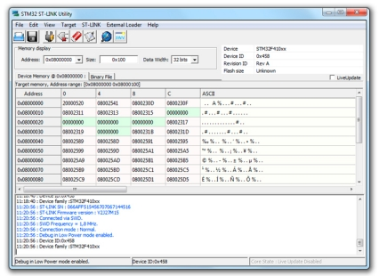

# STM32 ST-LINK Utility

### 描述

[STM32 ST-LINK Utility](https://www.st.com/en/development-tools/stsw-link004.html)（STSW-LINK004）是一个全功能的软件接口，用于STM32微控制器的编程。

它为读取、写入和验证一个内存设备提供了一个易于使用和高效的环境。
该工具提供了广泛的功能，可以对STM32内部存储器（Flash、RAM、OTP等）、外部存储器进行编程，验证编程内容（校验、编程过程中和编程后验证、与文件比较），并实现STM32编程自动化。
STM32 ST-LINK Utility以图形用户界面（GUI）和命令行界面（CLI）的形式提供。

- ### 所有功能

  - 免费软件
  - 支持摩托罗拉S19、英特尔HEX和二进制格式
  - 加载、编辑和保存由Assembler/Linker或C编译器生成的可执行文件和数据文件
  - 擦除、编程、查看和验证设备Flash存储器内容
  - 对外部存储器进行编程、擦除和验证，并提供外部闪存加载器的例子，供用户为特定的外部存储器开发加载器
  - 自动化STM32编程（擦除、验证、编程、配置选项字节、计算校验）。

  - 一次性可编程存储器编程
  - 支持编程和配置选项字节
  - 提供一个命令行界面
  - 比较文件和目标存储器
  - 支持实时更新模式下的内存和内核状态查看
  - ST-LINK/V2固件升级

<!-- ### Description

STM32 ST-LINK Utility (STSW-LINK004) is a full-featured software interface for programming STM32 microcontrollers. 

It provides an easy-to-use and efficient environment for reading, writing and verifying a memory device.
The tool offers a wide range of features to program STM32 internal memories (Flash, RAM, OTP and others), external memories, to verify the programming content (checksum, verify during and after programming, compare with file) and to automate STM32 programming.
STM32 ST-LINK Utility is delivered as a graphical user interface (GUI) with a command line interface (CLI).

- ### All features

  - Free software
  - Supports Motorola S19, Intel HEX and binary formats
  - Load, Edit and Save executable and data files generated by the Assembler/Linker or C compilers
  - Erase, Program, View and Verify device Flash memory contents
  - Program, Erase and Verify external memories with examples of external flash loaders, for users to develop loaders for specific external memories
  - Automate STM32 programming (Erase, Verify, Programming, Configuring option bytes, calculate checksum)

  - Programming One Time Programmable memory
  - Supports Programming and Configuring Option bytes
  - Offers a command line interface
  - Compare file with target memory
  - Supports memory and core status view in Live-update mode
  - ST-LINK/V2 firmware upgrade -->