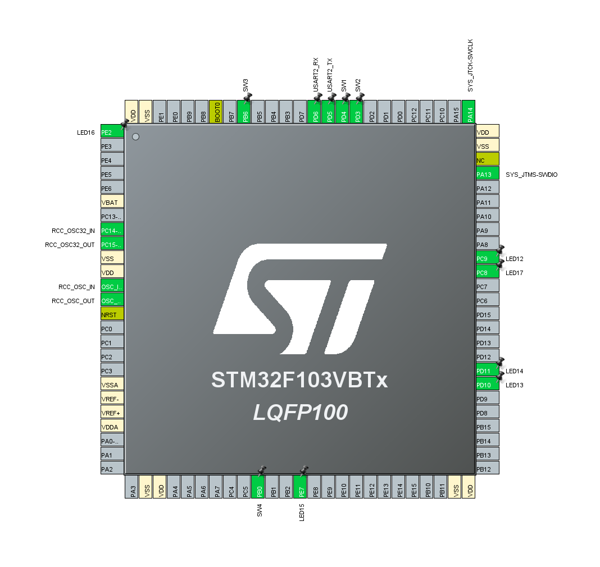
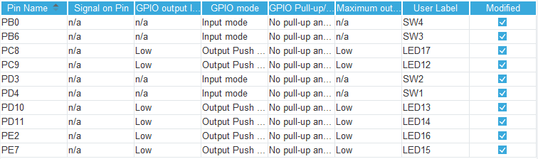
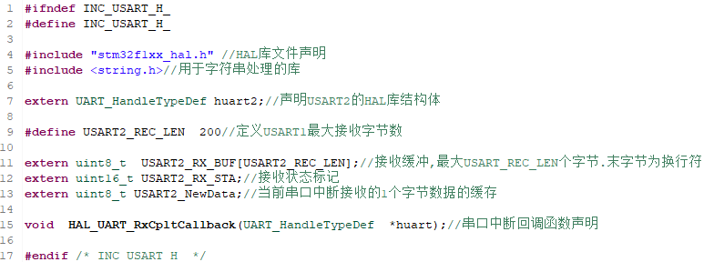
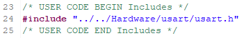

## usart实现板间通信

### usart简介

在STM32的参考手册中，串口被描述成通用同步异步收发器(USART)，它提供了一种灵活的方法与使用工业标准NRZ异步串行数据格式的外部设备之间进行全双工数据交换。USART利用分数波特率发生器提供宽范围的波特率选择。它支持同步单向通信和半双工单线通信，也支持LIN（局部互联网），智能卡协议和IrDA（红外数据组织）SIR ENDEC规范，以及调制解调器(CTS/RTS)操作。它还允许多处理器通信。还可以使用DMA方式，实现高速数据通信。

本次实验则是将usart用于实现板间通信，实现简单的用按键控制led灯的亮灭。

### usart工作原理

USART通过3个引脚与其他设备连接在一起，任何USART双向通信至少需要2个引脚：接受数据输入(RX)和发送数据输出(TX)。

>RX: 接受数据串行输入。通过过采样技术来区别数据和噪音，从而恢复数据。  
>TX: 发送数据输出。当发送器被禁止时，输出引脚恢复到它的I/O端口配置。当发送器被激活，并且不发送数据时，TX引脚处处于高电平。在单线和智能卡模式里，此I/O口被同时用于数据的发送和接收。

为了不让处理过程占用arm内核过长的时间，HAL库采用了和标准库不同的处理方式。

### 硬件设计

本次实验所用到的Hex-bot硬件拓展板为两块keyboard拓展板和一块inter-commucation拓展板，同时也需要两块主板进行板间通信。

考虑到Hex-bot开发板的设计，本次将通信板接于Hexport4,将keyboard接至Hexport5,注意两块主板上都需要接上keyboard，否则会在读取电平时发生异常。还需要注意的是要将4个跳线帽都接上。

### 软件设计

本实验是的代码部分相对简单CubeMX设置设置如下：

考虑到Hex-bot开发板的引脚分配，我们需要开启的是usart2，并且不要采用默认的引脚分配，而应该采用PD5和PD6。

具体的GPIO设置如下：

usart2使用默认参数即可,但要设置usart2的NVIC settings。

下面是对can协议进行处理的代码：

我们需要在main.c里面加入相关头文件：

然后还需要开启串口2接收中断：

还需要实现两个函数来达到按键读取和控制灯亮灭的目的：

然后我们在while循环里写入控制程序：

以上就是所有的代码部分，编写完成后下载到两块HEXBot主板里面。  
可以利用keyboard拓展板上的按键进行控制。

## 实验现象

可以看到按下按键，与这块keyboard拓展板相连的主板会先闪灯，之后另一块主板也会闪灯，达到了usart通信的目的。
