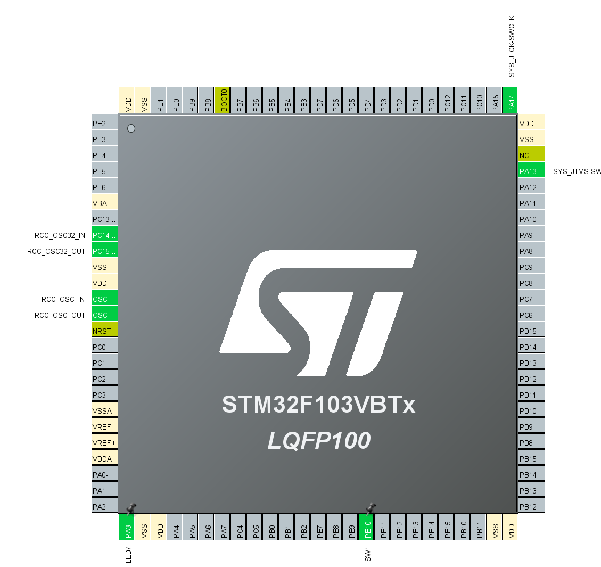
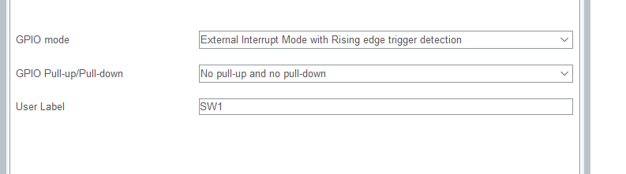

## 外部中断

#### 外部中断简介

中断是指一个突发时间，中止了CPU当前的工作，转而处理突发事件，处理完后再回到当前的工作并继续执行。

STM32允许多种多样的中断，如外部IO、ADC、USART、I2C、RTC、USB、PVD等。

<!--  -->

STM32F1系列单片机的外部中断/事件控制器包含19个边沿检测器，用于产生中断/事件请求。每个中断线都可以独立地配置它的触发事件什(上升沿或下降沿或双边沿)，并能够单独地被屏蔽;有一个挂起寄存器维持所有中断请求的状态。EXTI可以检测到脉冲宽度小于内部APB2的时钟周期。多达80个通用IO口连接到16个外部中断线。

外部中断引脚的标志位：

<!--  -->

其他中断标志位：

<!--  -->

STM32F1支持将所有GPIO设置为中断输入。
外部IO可由上沿、下沿、高低电平的三种方式触发。
可选择中断或事件触发。

#### 硬件设计

本实验所用到硬件仅为手柄块上面的一个按键和一组LED，如图所示

任选一组LED和按钮，这里我们以SW11控制LED7为例。

#### 软件设计

首先我们打开CubeMX对芯片进行引脚分配。

如图我们所用到引脚为LED7和SW1，所有只需要定义这两个脚就可以。由于我们是想用外部中断来控制，所以在SW1的GPIO口里需要选择EXTI10（根据中断位表来选择）,因为按键每次按下都会从低电平跳到高电平，因此我们选择高电平触发(这里电路里面已经有上拉电阻，所以这里不需要上拉)，同时打开NVIC选项卡，在里面选择打开EXTI10即可在然后创建即可。

下面进入程序编辑页面。

首先外部中断功能隶属于GPIO口，所以在主函数里面我们可以在GPIO口初始化函数里面找到外部中断初始化函数，打开stm32f1xx_it.c文件，在这里我们可以找到外部中断处理函数，再进一步跳转可以看到具体的函数体。

由于程序非常简单，下面我们直接进入main.c里面进行编程。

首先，定义一个变量，用来存储触发中断的端口信号。

接下来我们在主函数里面编写一个中断回调函数，用来控制LED。

如图， HAL_GPIO_TogglePin函数的作用是将GPIO引脚的电平翻转。这样就实现了我们每次按下按键，LED就会打开或者关闭，实现了开关的功能，但是它又不经过主函数，这样无论主函数有多长，我们按下按键LED都会立刻响应。接下来我们可以将程序写入开发板上面来观察效果。

我们还可以用其他的几个按键来控制其它板子上面的LED或其他功能，这个就由同学们自行想象和学习。
