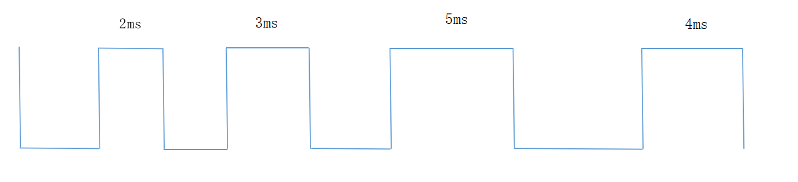
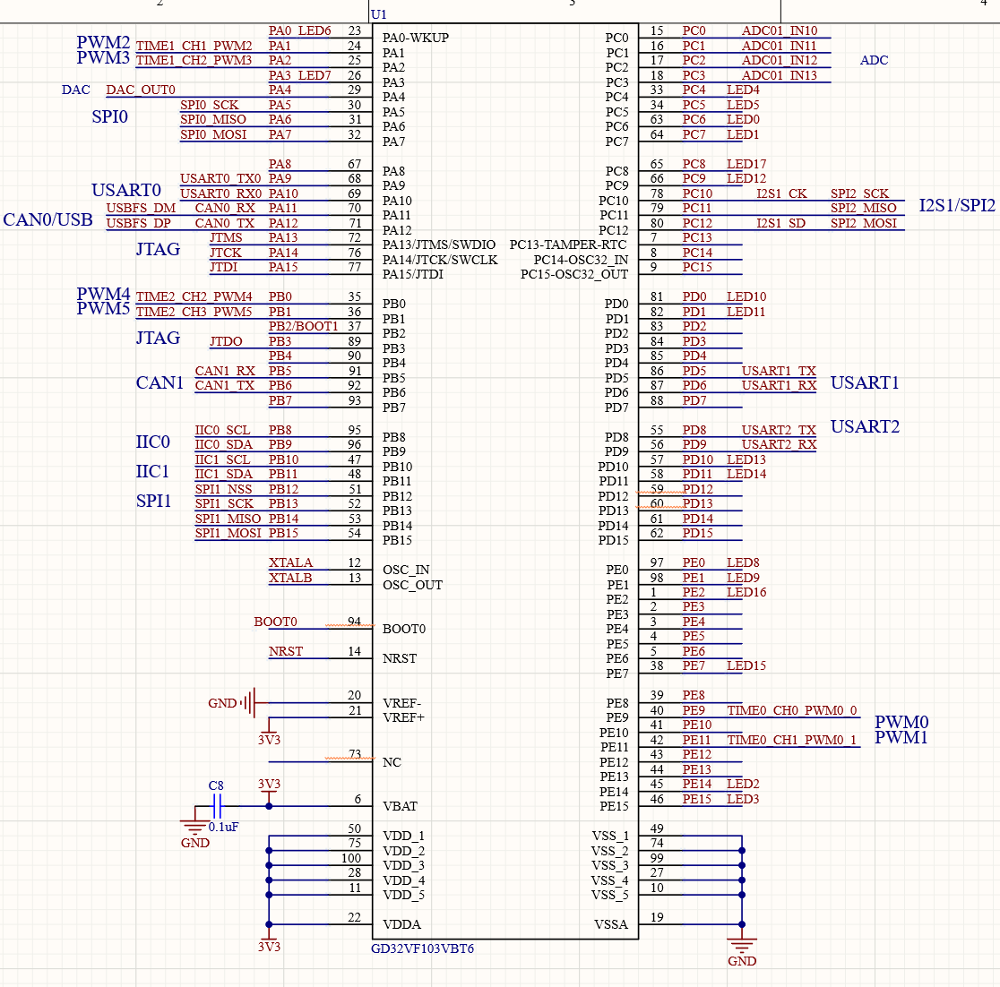
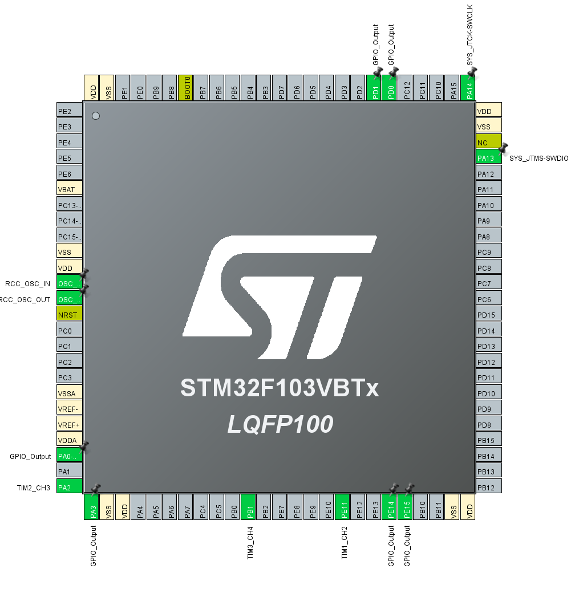
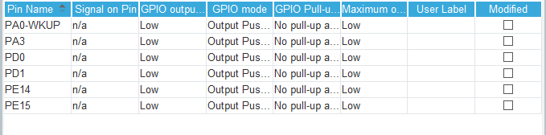
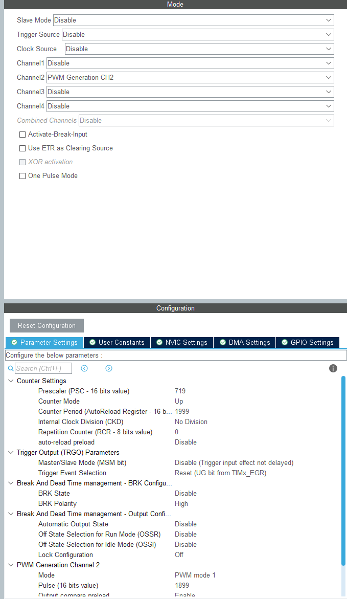
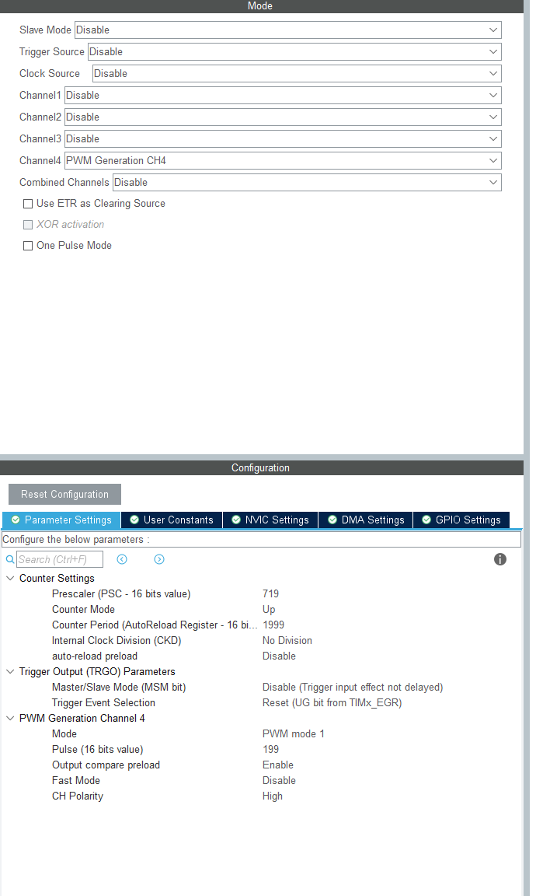
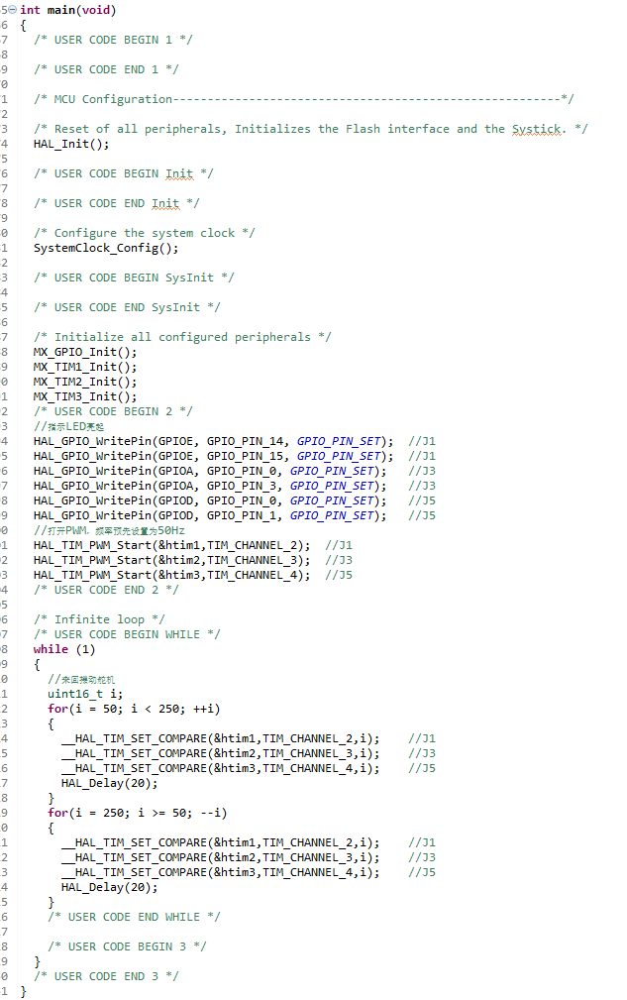

# 定时器-PWM控制

## PWM波简介

PWM是Pulse Width Modulation的缩写，它的中文名字是脉冲宽度调制，一种说法是它利用微处理器的数字输出来对模拟电路进行控制的一种有效的技术，其实就是使用数字信号达到一个模拟信号的效果。

这是一个周期是 10ms，即频率是 100Hz 的波形，但是每个周期内，高低电平脉冲宽度各不相同，这就是 PWM 的本质。在这里大家要记住一个概念，叫做“占空比”。占空比是指高电平的时间占整个周期的比例。比如第一部分波形的占空比是 50%，第二部分波形占空比是 60%，第三部分波形占空比是 67.5%，这就是 PWM 的解释。

那为何它能对模拟电路进行控制呢？大家想一想，我们数字电路里，只有 0 和 1 两种状态，比如我们第 2一个实验里学会的点亮 LED 小灯那个程序，当我们写一个 LED = 0;小灯就会长亮，当我们写一个 LED = 1;小灯就会灭掉。当我们让小灯亮和灭间隔运行的时候，小灯是闪烁。

如果我们把这个间隔不断的减小，减小到我们的肉眼分辨不出来，也就是 100Hz 以上的频率，这个时候小灯表现出来的现象就是既保持亮的状态，但亮度又没有 LED = 0;时的亮度高。那我们不断改变时间参数，让 LED = 0;的时间大于或者小于 LED = 1;的时间，会发现亮度都不一样，这就是模拟电路的感觉了，不再是纯粹的 0 和 1，还有亮度不断变化。大家会发现，如果我们用 100Hz 的信号，如上图所示，假如高电平熄灭小灯，低电平点亮小灯的话，第一部分波形熄灭 2ms，点亮 2ms，亮度最高，第二部分熄灭 2ms，点亮 3ms，亮度次之，第三部分熄灭 3ms，点亮5ms，亮度最低。那么用程序验证一下我们的理论，我们用定时器T0 定时改变 端口的输出来实现 PWM，与纯定时不同的是，这里我们每周期内都要重载两次定时器初值，即用两个不同的初值来控制高低电平的不同持续时间。为了使亮度的变化更加明显，程序中使用的占空比差距更大。

## 硬件设计

STM32单片机并不是所有的IO口都可以输出PWM波，而是在某些特定的引脚可以输出PWM波，因此在使用单片机的pwm波输出功能时，首先要通过芯片手册查询哪些引脚可以输出pwm波。通过查看hexbot开发板的原理图可以知道有六个脚可以输出pwm波，我们任意选取其中的一组来输出即可，这里我选择的是Port5和Port1两个电机块上面的pwm波输出口。

## 软件设计

在选好pwm口后，我们打开CubeIDE进入Cube_MX图形界面进行引脚分配。设置成如下所示：

IO口设置为：

三个定时器设置分别为TIM1,TIM2,TIM3,如下：

定义完成后进入主程序编辑界面：

在主程序里编写以下代码：

编写完成后烧录进开发板上面后可以看到所有块上面的LED亮起，同时两个电机块的电机开始转动。
