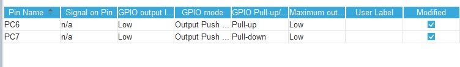
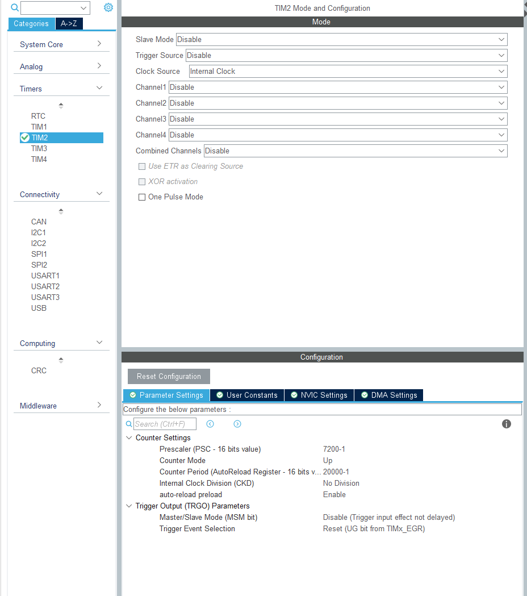
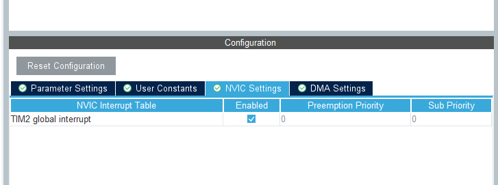
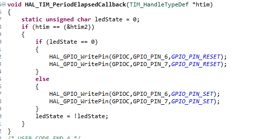

# 定时器

## 定时器简介

   单片机定时器其实跟我们平时常说的计数器，是同一个电子元件，只不过计数器记录的是单片机外部情况，所接收的也是外部脉冲，而定时器则是由单片机自身提供的一个非常稳定的计数器，这个稳定的计数器就是单片机上连接的晶振部件。

  在单片机中，分为软件定时器，不可编程硬件定时器，可编程定时器。

　　1、软件定时：CPU每执行一条指令时，是需要固定时间的，所以，通过执行空指令可以达到延时的效果，这样子做的代价是占用CPU时间，所以一般很少这么做。

　　2、不可编程硬件定时器：是由电路和硬件来完成定时功能的，一般采用基本电路，外接定时部件（电阻和电容），通过改变电阻的阻值和电容的电容值来修改定时值，一旦确定后件不能通过软件修改，这样子做的优点是不需要占用CPU时间。

　　3、可编程定时器：通过软件来确定定时值及其范围，可编程定时器功能强大，灵活性高。

单片机定时器工作原理

　　定时器的核心是一个加1计数器，在作定时器使用时，它对机器周期进行计数，每过一个机器周期计数器加1，直到计数器计满溢出。当它用作对外部事件计数时，计数器接相应的外部输入引脚T0（P3.4）或T1（P3.5）等等，并在每个机器周期的S5P2时采样，当采样到1—0的负跳变时，计数器加1。

　　所以，单片机定时器的工作原理本质上是一个计数器。每次脉冲下降时，计数寄存器值将增加1。如果计数脉冲来自单片机内部的晶体振动，则称为定时器；如果计数脉冲来自单片机外部的引脚，则称为计数器。

 

## 硬件设计

此次实验仅为定时器的简单应用，即利用定时器进行延时达到控制LED闪烁的功能，因此所需硬件比较简单，如下，需要HEXBot的主板和下载板即可，这里我们只讲定时器的基础应用，下一部分将会讲解定时器的另一个用法pwm。

 

## 软件设计

根据要求将CubeIDE中的引脚定义为如下所示

这里我们将引脚定义如上图所示即可。

定时器设置为如下：

定时器中断的设置如下图所示：

设置完成后记得打开定时器中断。

设置完成后生成程序。

然后我们进入主程序编写程序，在main.c下面编写一个定时器中断回调函数来控制led。如下图所示，函数为：

然后下载到开发板上面即可看到下载板上的两排led在交替闪烁。

不难发现，关于led闪烁的程序并没有进入到主函数循环里面，而是在主程序外就完成了，也没有使用到延时函数。
