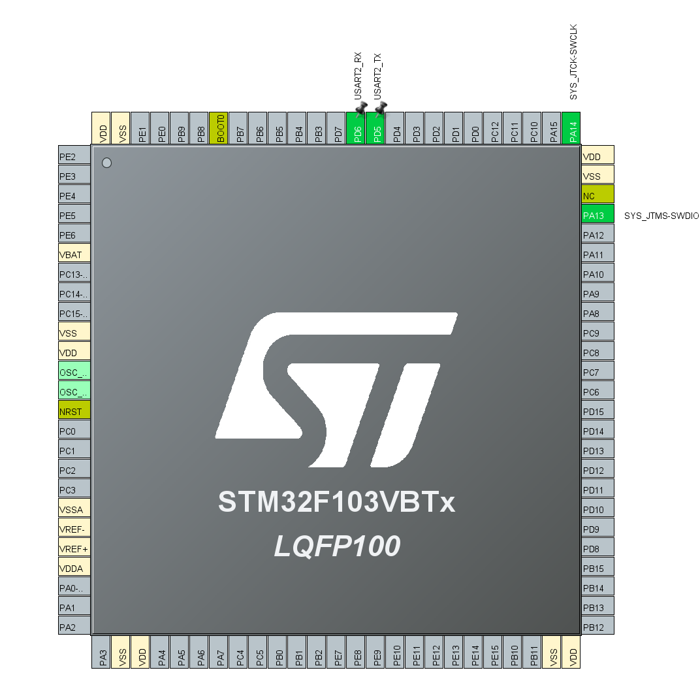
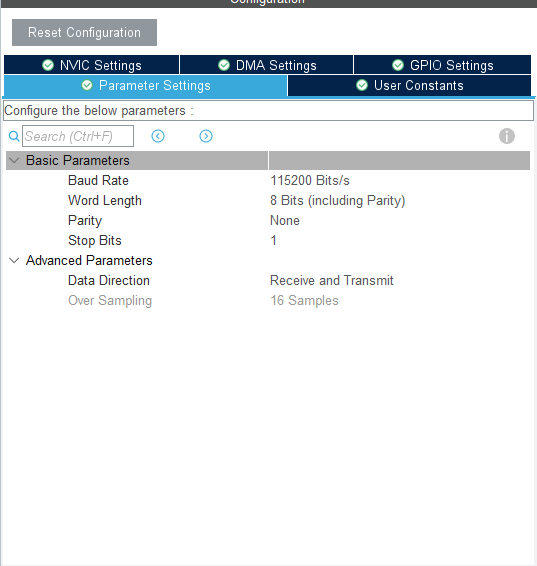
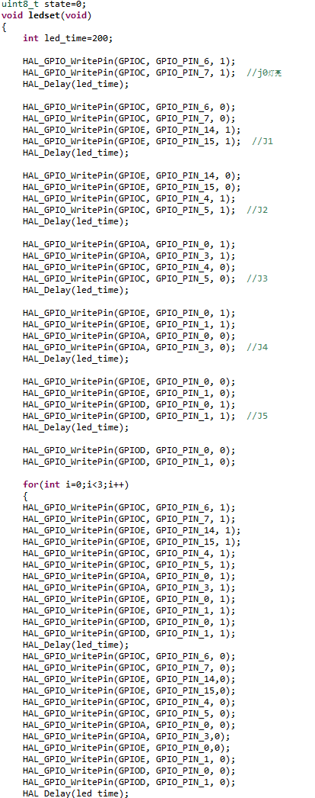
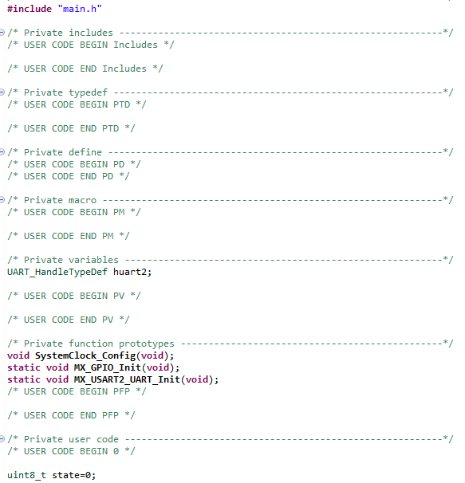
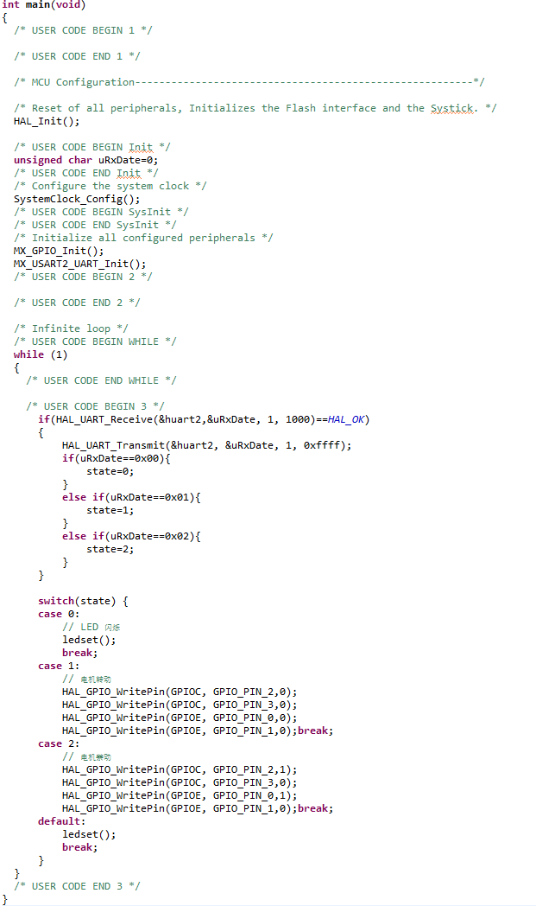

# 蓝牙通信

本实验通过使用JDY23蓝牙模块，可以使HEXBOT与电脑、手机通过蓝牙通信。

前往[Github](https://github.com/H3XBOT/STM32F103-Code/tree/main/%E8%93%9D%E7%89%99%E9%80%9A%E4%BF%A1)下载本实验代码。

## 什么是蓝牙

蓝牙技术是一种无线数据和语音通信开放的全球规范，它是基于低成本的近距离无线连接，为固定和移动设备建立通信环境的一种特殊的近距离无线技术连接。 蓝牙使当前的一些便携移动设备和计算机设备能够不需要电缆就能连接到互联网，并且可以无线接入互联网。

即使是在无线通信领域WIFI具有更高的性能和更强大的扩展性，但蓝牙以其低成本、低功耗，依然在移动设备的近场无线通信中占据一席之地。在物联网的开发中，蓝牙依然是低成本低功耗的智能电子设备。

## 硬件设计

在HEXBot的蓝牙拓板上焊接有一个蓝牙模块，它是市面上非常常见的一款蓝牙模块，型号是JDY-23，它所拥有的功能足够我们学习使用，在学习该模块时，首先我们要学会阅读对应模块的数据手册。打开开发板所带文件夹里面的蓝牙部分，找到并打开 JDY-23蓝牙5.0数据手册 。这里面有我们想要的关于蓝牙块使用的所有信息。

在数据手册里，我们需要重点关注的是模块的电路原理和使用方法。简单阅读数据手册后我们打开蓝牙模块的原理图，在原理图里面我们可以看到，蓝牙模块和主板之间是通过串口来通信的。

这是蓝牙模块的接线图，简单介绍一下所接引脚的作用：

STAT：连接状态引脚，当蓝牙连接是引脚为高电平，断开时为低电平，这里外接一个LED来判断蓝牙工作状态。

RESET：复位脚。

RXD：串口输入脚。

TXD：串口输出脚。

ALED：广播指示引脚。

蓝牙模块的核心芯片实际上是一块小型的单片机，它也可以使用单片机的各种功能，我们也可以用它来控制多种外设。在这里我们利用蓝牙来接收和发送数据，借以无线控制各个电路的功能。

## 软件设计

本实验在CubeIDE里面所用到的引脚很少，单独使用蓝牙只需要打开芯片的串口通信功能即可，因此我们在CubeMX里的设置应该是这样的：

值得注意的是，我们需要在NVIC选项卡里面打开USART2的中断功能，并且还需要设置串口的传输速率，如图所示：

设置完成后我们进入代码编辑界面，为了方便同学们学习，直接在蓝牙的主程序main.c里面编写一个简单的蓝牙控制程序。

下图我简单编写了一个想要蓝牙控制的程序，大家可以简单看一下，就是一个led的控制程序。

在进入主程序前我们须要声明一下需要加载的头文件和定义：

如图所示的代码

void SystemClock_Config(void)      系统时钟引用

 static void MX_GPIO_Init(void)      IO口初始化

static void MX_USART2_UART_Init(void)   串口初始化

接下来进入主程序：

以上就是所有的代码部分，编写完成后下载到HEXBot里面，然后再用手机端的蓝牙小程序来控制即可，控制部分可以看文件自带的蓝牙模块数据手册。
